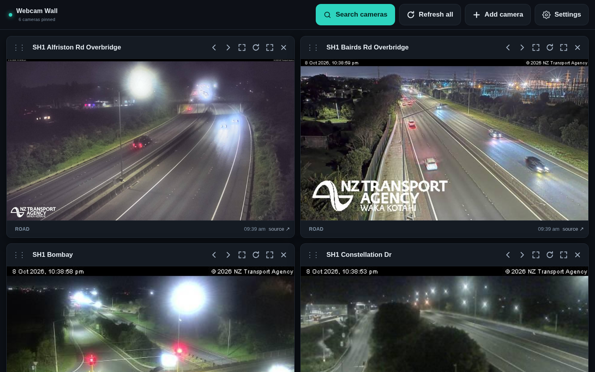

# Webcam Wall

A single-page dashboard of New Zealand webcams. Search a camera list, pin the ones you
want to your own wall, give each tile your own title, and leave it up on a second screen.

**Everything is one static `index.html`.** No build step, no server, no npm — GitHub Pages
serves it as-is. Your layout is saved in your own browser, so there's no account or database.
An optional portable backup lets you copy or move the wall safely.



---

## What's in it

| Source | What you get | Key needed? |
| --- | --- | --- |
| **Road cameras** | 313 NZTA / Waka Kotahi state-highway cameras, ~248 online at a time. Plain JPEG snapshots. | No |
| **Local cams** | 79 NZ webcams from the [online-australia.net](https://online-australia.net/nz) directory — council, surf-club and community cameras (Mangakuri Beach, Port Taranaki, Taylors Mistake, Mount Maunganui…) that the other sources don't carry. | No |
| **Live video** | Hand-picked NZ YouTube live streams (Auckland harbour, Raglan bar & Manu Bay, Lyall Bay, Wellington Airport, Castlepoint, Napier Port penguin cams, Royal Albatross cam…). Every one was checked as *live* **and** *embeddable*. | No |
| **Windy webcams** | ~490 NZ webcams from Windy — beaches, harbours and towns NZTA doesn't cover. | Key built in |
| **Add by URL** | Paste any image URL or `<iframe>` embed code (another council/beach cam, a YouTube link, anything). | No |

That's **~870 searchable cameras** in one list, deduplicated: where the local directory
already lists a Windy camera, it's shown once (under its nicer name, with a keyless image).

## How it's laid out

Two full pages, with the current one kept in the URL (`#home` / `#search`) so the browser's
Back and Forward buttons work naturally:

**Home** — your wall. The cameras you pinned, with your own titles, arranged how you like.
The header shows **Search cameras · Refresh all · Add camera · Settings**.

**Search** — a full page for browsing the catalogue: a big search box, source filters, and a
grid of camera cards with thumbnails you can see before adding. YouTube cards show still thumbnails;
the actual stream loads on the wall. Press **Add** on a card and you land straight back on your wall
with the new tile highlighted — or press **Home** (top left),
click the logo, or hit `Esc` to go back without adding anything.

On a phone the same two pages work as-is: searching is a full screen rather than a cramped drawer.

Features: **full-page search** with thumbnail cards, so you can see a camera before adding it ·
Back/Forward and deep links (`…/#search`) work · type-ahead search across all sources ·
relevance ranking · **macron-insensitive search** (`whangarei` finds `Whangārei`) ·
filter chips (All / Road cams / Live video / Local cams — kept on a single line, and sized so
they stay readable without crowding) · **every match is shown — results aren't capped** ·
hide-offline toggle ·
per-tile **editable titles** · drag to reorder · move-left/right buttons · small/medium/large
tiles · single-tile fullscreen · manual or per-tile refresh · **Settings panel for API keys** ·
dark UI with large, easy-to-hit controls (all header buttons are 52 px tall, 17 px labels) ·
responsive down to phones · layout saved in `localStorage` · **portable backup and restore** (copy/paste or download a JSON file).

*Snapshots vs live video:* NZTA and Windy tiles are still images that update when the
provider takes a new frame (and when you hit ↻) — they are not video streams. YouTube tiles
are real live video.

---

## Versioning

The source of truth is this Git repository. Commit each app build so changes can be reviewed or rolled back,
and increment `BUILD_ID` in `index.html`; the header displays `vN`, while Settings and the search receipt
show the matching build number.

---

## Deploying to GitHub Pages

1. Create a repository (public is fine — it's all client-side).
2. Add these files to the root:
   ```
   index.html
   cameras.json
   webcams.json
   .nojekyll
   README.md
   LICENSE
   screenshot.png
   tools/update-cameras.py
   tools/update-webcams.py
   ```
3. Commit and push.
4. Repo **Settings → Pages** → *Source: Deploy from a branch* → **Branch: `main`, folder: `/ (root)`** → Save.
5. Wait a minute; your wall is at `https://<your-username>.github.io/<repo-name>/`.

Nothing else to configure — `.nojekyll` stops Pages from running Jekyll over the files.

### Testing locally

The baked camera lists keep the basic page usable if you double-click `index.html`, but YouTube
embeds need a real HTTP/HTTPS page address so YouTube can identify the embedding site. For working
YouTube players (and the *Reload camera list* button, which reads `cameras.json`), serve it locally:

```bash
python3 -m http.server 8080     # then open http://localhost:8080
```

---

## Keeping the camera lists current

Both lists are scripts, not services — there's nothing to maintain:

```bash
python3 tools/update-cameras.py    # NZTA road cameras  → cameras.json + index.html
python3 tools/update-webcams.py    # local directory    → webcams.json + index.html
```

Both use only the Python standard library. `update-webcams.py` walks every NZ camera page on
online-australia.net, skips cameras we already cover from NZTA, **checks that each image still
actually loads** (dead or hotlink-blocked feeds are dropped), then writes the results.
`--no-verify` skips that check when you just want a quick refresh.

Refresh NZTA adds and removes cameras over time. To refresh:

That downloads the current list, writes `cameras.json`, **and** re-bakes the same list into
`index.html` (so the page still works opened straight off disk or in a preview pane).
Then commit and push both files.

Because NZTA's list API doesn't send CORS headers, this can't be done from the page itself —
which is why the list is baked in and refreshed by a script instead. Two ways to read a
fresh copy without reloading the page:

* **↺ Reload camera list** (bottom of the sidebar) re-reads `cameras.json` from your site.
* The list is also re-read automatically on every page load; if that fetch fails, the baked
  copy is used, so the page never comes up empty.

---

## Adding Windy webcams (optional)

Windy has far more NZ webcams than NZTA, but its API needs a key:

1. Make a free account and grab a key at **<https://api.windy.com/keys>**
   (choose the **Webcams** API — keys are per-product).
2. **You don't have to do anything** — a Windy key is already built into the page
   (`DEFAULT_WINDY_KEY` in `index.html`), so Windy's ~490 NZ webcams are in the search from first load.
   To use your own key instead, open **⚙ Settings**, paste it and press **Save & connect**.
   **Forget key** removes it; **Use built-in key** puts the packaged one back.
3. Windy cameras appear in results alongside everything else (the source badge on each card
   tells you where it came from). Windy gets its own section in **⚙ Settings → Camera sources**,
   including a **Reload Windy list** button if its list ever needs refetching.

Notes worth knowing:

* Whichever key is in use lives in your browser's `localStorage` only — it is never sent
  anywhere except to `api.windy.com` (and back to Windy when you refresh image links).
* **The built-in key is public**, because everything in a static page is. On the free tier that
  only allows webcam lookups, so it isn't sensitive — but if you'd rather not share it, generate
  your own key and change `DEFAULT_WINDY_KEY`, or just paste your own key in Settings
  (your saved key always overrides the built-in one).
* The free tier returns **tokenised image URLs that expire after ~10 minutes**, so the page
  fetches a fresh batch whenever it loads and when you press **↻** (refresh all) or a tile's
  refresh button. A tile showing a 401 just needs a refresh.
* Attribution: Windy's free tier expects a link back to windy.com — every Windy tile has a
  **source ↗** link in its footer. Keep that link if you host this publicly.
* The free tier caps list pagination at 1000, which is well above NZ's webcam count.

The page is a self-contained fallback-free experience without a key: road cameras, live video
and custom URLs all keep working.

---

## Using the wall

| Action | How |
| --- | --- |
| Open the catalogue | **Search cameras** in the header (or the button in the empty state). |
| Add a camera | **Add** on any card — you return to your wall with the new tile highlighted. |
| Leave the search page | **Home** (top left), the title/logo, the browser's Back button, or `Esc`. |
| Rename a tile | Click its title and type — that's your label for the location. Save is automatic. |
| Reorder | Drag a tile by its `⋮⋮` handle, or use the ‹ › buttons. |
| Resize a tile | **⤢** cycles small → medium → large. |
| One camera fullscreen | **⛶** on the tile (`Esc` to leave). |
| Get a newer frame | **↻** on a tile, or **Refresh all** in the header. |
| Remove one / all | **✕** on the tile / **Remove all cameras** in Settings. |
| Another cam entirely | **+ Add camera** — paste an image URL, a YouTube link, or an `<iframe>` embed. |
| Backup / restore | **⚙ Settings → Backup & restore** — copy the backup text or download a `.json` file; restore by pasting it or choosing the file. |
| API keys / camera list | **⚙ Settings** in the header — Windy key, a camera-source breakdown, and reload the camera lists. |
| Filter by source | The chips on the search page: All · Road cams · Live video · Local cams. |
| Camera counts by source | **⚙ Settings → Camera sources** (deliberately kept off the main pages). |
| Camera credits | The **Credits** line at the very bottom of the wall — tap it to expand the full attribution (NZTA, Windy, online-australia.net, YouTube). |
| Check which build you're running | The `· build N` line in the search page's footer receipt (**⌘/Ctrl-F** for "build"), or the version marker at the bottom of **⚙ Settings**. The search footer also states the result count plainly: *"Showing all 808 cameras — nothing is hidden"*. |

**Where your wall lives:** in `localStorage` for that browser on that device. It is not synced
between devices, and clearing site data clears the wall (this also resets any Windy key you
entered in Settings — the built-in default comes back). Private/incognito windows start fresh.

To keep or move a copy, open **⚙ Settings → Backup & restore → Create backup**. Copy the text
into Notes/email or download the `.json` file; on the other browser/device, paste it or choose
the saved file and press **Restore backup**. It includes the camera IDs, your titles,
order, tile sizes, custom-camera URLs and display preferences, but deliberately omits the Windy
API key and short-lived image cache. Restore replaces the wall and display preferences while
keeping the API key already set in that browser. Custom URLs are included, so keep the backup
private if any URL contains a token.

---

## Files

```
index.html                  the whole app (UI + logic + both baked camera lists)
cameras.json                NZTA road-camera list, read at runtime
webcams.json                local camera directory, read at runtime
tools/update-cameras.py     refreshes cameras.json + the baked copy from NZTA
tools/update-webcams.py     refreshes webcams.json + the baked copy from the directory
.nojekyll                   tells GitHub Pages to serve files untouched
```

---

## Attribution & caveats

* Road camera images © **NZ Transport Agency Waka Kotahi**, licensed [CC BY 4.0](https://creativecommons.org/licenses/by/4.0/),
  sourced from their [Traffic & Travel open data](https://www.nzta.govt.nz/traffic-and-travel-information/use-our-data/).
  Images are snapshots, not live video, and are served directly from `trafficnz.info`.
* Windy webcam data by [Windy.com](https://www.windy.com); tiles link back to the webcam page.
* Live video is embedded from each channel's own YouTube stream and remains theirs.
* Local cams are listed in the [online-australia.net](https://online-australia.net/nz) public
  directory — the app records the published image URL for each camera; **the imagery stays hosted
  by whoever runs that camera** (councils, surf clubs, community groups), and each tile has a
  **source ↗** link back to the directory page for that camera.
* Some directory cameras are frozen or stale — the newest frame is sometimes days or weeks old and
  the image itself usually says so in its timestamp overlay.
* This is a personal viewer, not affiliated with NZTA, Windy, online-australia.net or any camera operator.
  Cameras go offline; press ↻ to retry a tile that shows *Image unavailable*.
* The camera feed URLs are undocumented-but-public endpoints. If NZTA changes them, run
  `tools/update-cameras.py` — the script will say so if the endpoint moves.
